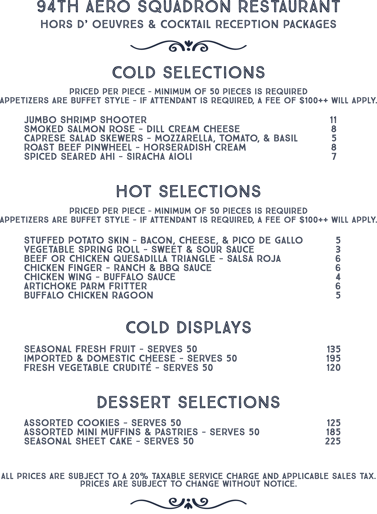
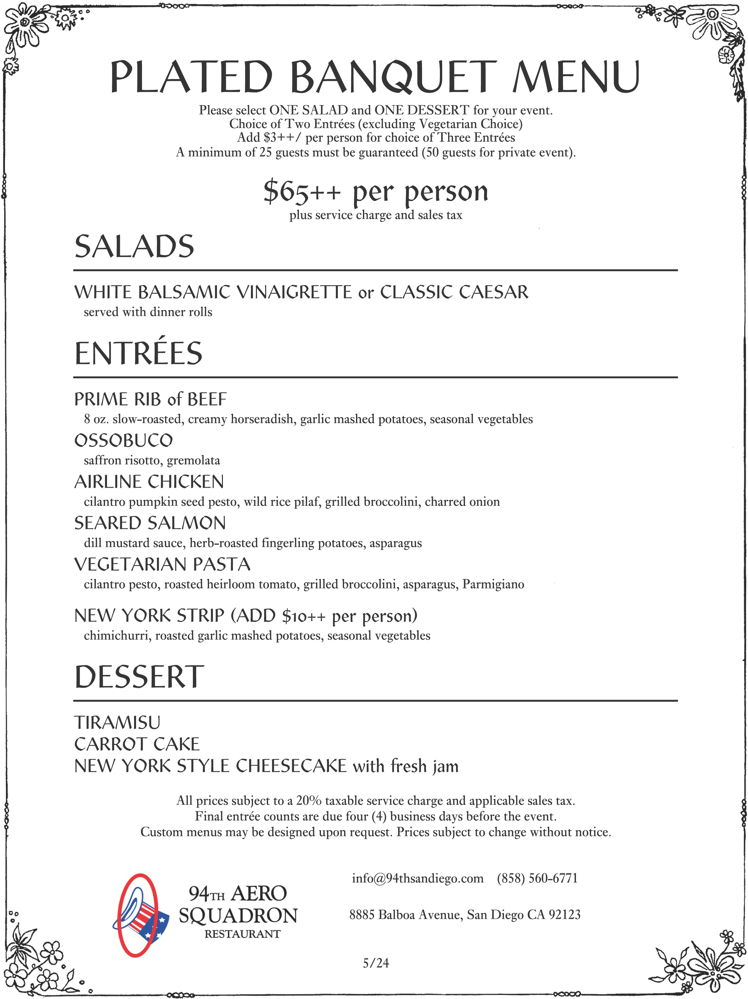
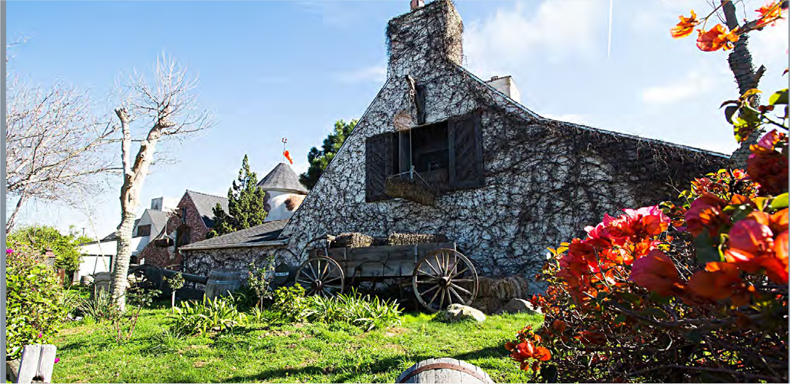
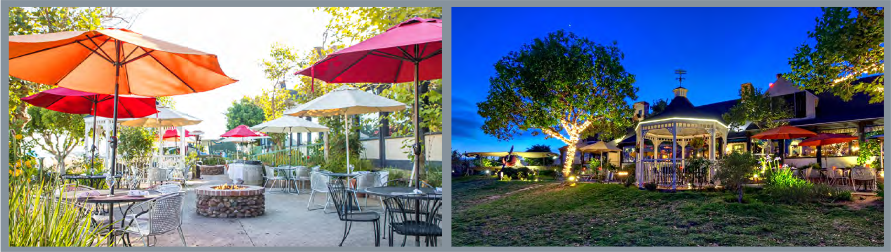
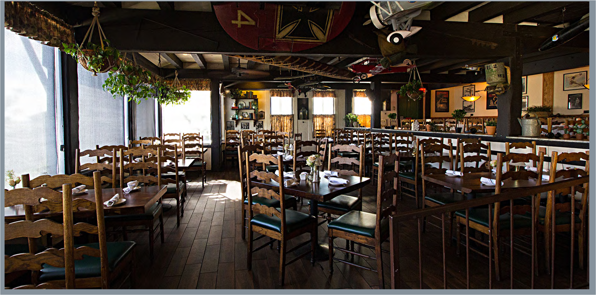
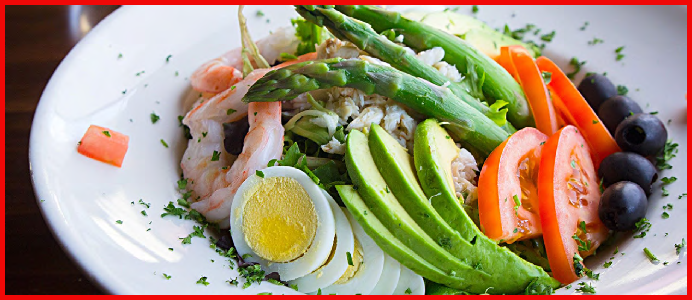
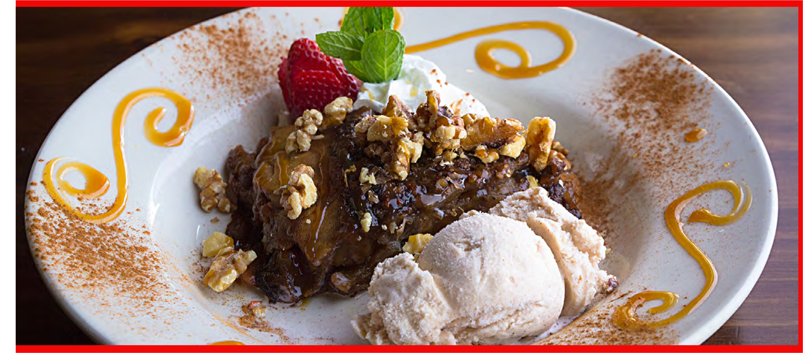

* Due to the seasonality of the restaurant, these options may be altered for your actual event with your final approval.

●

Current Event Bar Menus *

●

Current Event Dinner Menus *

●

More information on an a.o.c. brentwood buyout

●

Pricing

●

Private Events Brochure

Attached please find the following:

Please note, because you are dancing, we will need to have you bring in a dance floor to protect the floors, as well as additional insurance for your guests.

***With a full restaurant buyout, you will have access to three beautiful, spacious, Nickey Kehoe designed dining rooms: the San Vicente Room, the Green Room, and the Main Room for up to 150 total as a standing, cocktail style reception. The price is $20,000 (Sun) or $26,000 (Fri/Sat) for up to 80 guests and $150 per person thereafter. This price includes private use of the restaurant, a specialty menu (food stations with tray passed hors d'oeuvres are recommended), and beverages (sommelier select wine, specialty cocktails, and select-spirit open bar). All prices are before tax, fees, and gratuity.***

Thank you for this information. For something like this, it would need to be a full restaurant buyout.

*anything not on this list will be added to the final bill* *cocktails subject to change with seasonal produce*

green tea, cucumber, arugula & jalapeño

### “mock” goddess

pomegranate, orange, cinnamon & soda

### bleeding heart

grapefruit, lemon & house ginger ale

### ruby blush

## “free spirited”

mezcal, lime, passion fruit & achiote

# passion al pastor

bourbon & housemade sassafras-maple bitters

# kingbird

*tequila, lime, orgeat & spiced persimmon *contains nuts*

# harbinger

gin, lemon, pomegranate & coconut

# wonder punch

green tea-infused vodka, cucumber, arugula, jalapeño & absinthe rinse

# green goddess

**cocktails choose 3**

# red

# rose

# white

# sparkling

**sommelier select wines**

# dinner event bar offerings

*anything not on this list will be added to the final bill* *cocktails subject to change with seasonal produce*

suntory toki

kavalan

jameson laphroaig 10yr jura seven wood benromach

el dorado 12yr marti white

## **scotch/irish/japanese**

## **rum**

heaven hill 7yr

eagle rare angel’s envy michter’s

angelisco blanco casamigos blanco casamigos reposado siete leguas blanco siete leguas reposado angelisco reposado el silencio (mezcal) legendario (mezcal)

evan williams

## **bourbon**

breaking & entering

high west double rye michter’s rye rittenhouse

## **agave**

## **whiskey**

nolet’s

bombay sapphire tanqueray botanist

chopin grey goose

st. george “terroir” east london batch

tito’s

## **vodka**

## **gin**

# select spirit open bar

on market availability*

*a.o.c. is seasonally driven,

options subject to change based

Each of these menus is a complete menu of shared plates. Dishes will be served one or two at a time beginning at the top of the menu and continuing to the bottom. Each line indicates a different item. Requested changes are subject to approval.

chocolate torta, butterscotch pot de crème, assorted chocolates & house confections

### a.o.c. dessert platter

*******

### cauliflower, curry & red wine vinegar

### roasted chicken “ode to zuni,” panzanella, fennel & green olives

*******

### farro & black rice, currants & pine nuts*

### market fish, celery root, brussels sprouts, sherry & golden raisins

*******

### royal corona beans, weiser cucumbers, tomato, oregano & feta spinach and dandelion, persimmon, avocado & candied pecans

*******

### three cheese plate with accompaniments & a.o.c. bread

roasted vegetables, muhammara & chickpea purée, burrata & grilled toast

### the farmer’s plate

### bacon-wrapped dates stuffed with parmesan

**a.o.c. dinner event menu 1**

*a.o.c. is seasonally driven, options subject to change based on market availability*

Each of these menus is a complete menu of shared plates. Dishes will be served one or two at a time beginning at the top of the menu and continuing to the bottom. Each line indicates a different item. Requested changes are subject to approval.

rum caramel, persimmon & pepita tuile

### crème fraiche panna cotta

kadaif rocher, pistachio butter & vanilla whipped cream

### chocolate torta

**soft polenta, wild mushrooms, swiss chard, mascarpone & gremolata *****

### hanger steak, sauce béarnaise, arugula & fried shallots

*******

### spiced fish tagine: kabocha squash, quinoa, dried cranberries, turmeric & pepita pesto

### apples, pears, chicories, honey & point reyes fennel blue spanish fried chicken, romesco aïoli & chili-cumin butter ***

*******

### marinated olives & marcona almonds

pork rillettes, assorted salumi, chorizo & grilled toast

### charcuterie board

### three cheese plate with accompaniments & a.o.c. bread

**a.o.c. dinner event menu 2**

**a.o.c. brentwood is the newest restaurant from the James Beard Foundation’s Outstanding Chef, Suzanne Goin, and Outstanding Restauranteur / renowned wine director, Caroline Styne. Following the success of sister restaurant a.o.c. west hollywood, brentwood brings the same shared-plate menus and hand-selected wines to the westside for an unforgettable dining experience.**

**a.o.c. brentwood san vicente room, green room, main dining room & restaurant buyout information**

a.o.c. brentwood requires a signed event agreement and a deposit for 50% of your anticipated total within 24 hours to reserve the space and date. After 24 hours, the space will be made available to other inquiries unless other arrangements are made. Please keep in mind that the space and date are not reserved until a completed agreement and deposit are received by a.o.c. Cancellation (or rescheduling) of the event or the specified event date, with less than 14 days’ notice from the event date will result in forfeiture of the deposit.

## Event Agreement:

The tax is standard Los Angeles County 9.5% sales tax. The gratuity for the staff ranges between 18%-22%. A 6% charge is added to all checks to cover the cost of full healthcare benefits for our full-time employees; if you would like this charge removed, please let us know. In addition, a 5.5% administration fee will be added to the final bill.

## Tax, Gratuity & Fees:

There are male and female bathrooms located inside the restaurant. The bathroom would be available to other restaurant guests that are dining, unless buying out the entire restaurant.

## Bathroom:

a.o.c. brentwood is provided as a fully furnished dining space with beautiful, handcrafted wooden tables. Depending upon your specific needs and guest count, and particularly for reception layouts, it may be necessary to remove and store furniture for the duration of the event. Any removal and storage of furnishings will be the responsibility of the client and must be done prior to guest arrival. Table linens are not used at a.o.c.

## Seating:

Limited, metered street parking is available. a.o.c. brentwood does not have valet. Instead, there is a validated self-park lot just south of the restaurant on Darlington Ave. You may choose to host full validation for your guests’ parking for $19 per car. If you do not host parking, your guests will receive the standard 90-minute validation that a.o.c. brentwood offers to all guests. If you choose to host your guests’ parking, it will be charged post-event through the online portal.

## Parking:

All dining areas are located on the ground floor of a.o.c. brentwood and are ADA accessible.

## Accessibility:

[Table 1011 - See Excel file: tables/fileoutpart6.xlsx]

**Hours of Operation**

**Location: 11648 San Vicente Blvd. Los Angeles, CA 90049**

# Basic Information

a.o.c. brentwood’s event selection of premium artisanal spirits, specialty cocktails and beer, are included in your dining experience. Satellite bars are discouraged therefore all spirits and cocktails will be prepared at a.o.c. brentwood’s bar. Menus that offer only the included spirits, cocktails and beers will be available for your guests. You are welcome to select one or two of a.o.c. brentwood’s specialty cocktails to be tray-passed to your guests upon arrival. Please include your selections when returning your menu selection and all other details.

## Liquor:

A white, red, sparkling and rosé wine will be selected by the sommelier from a.o.c. brentwood’s ever-evolving list of organically, biodynamically and sustainably produced boutique wines. Different wines or premium wines are available for the difference in cost, per bottle, beyond the included $50 price; wine upgrades must be arranged well in advance of your visit, and are based upon availability.

## Wine:

To be in compliance with State of California alcohol licensing restrictions, a.o.c. brentwood uses its discretion when serving wine, beer, and spirits. In order to maintain the safety of guests and employees, shots and the excessive consumption of alcohol are not allowed.

## Alcohol Consumption:

You are more than welcome to bring your own cakes, which can be presented and cut at no extra cost. Please tell us in advance and make sure that it is delivered, clearly-labeled with your name and date, in a fully enclosed box with instructions, including whether or not it needs to be refrigerated. Include your selections when returning your menu selection and all other details.

## Cake:

a.o.c. brentwood is able to accommodate a variety of allergies and food preferences. Please let us know as early as possible, particularly during the menu selection process. a.o.c. is not a kosher kitchen but is able to do kosher style.

## Allergies:

Because a.o.c. brentwood is a seasonal restaurant with the highest standards for its produce and proteins, menu selection will occur 2-3 weeks prior to your event to ensure the offerings are up to date. This includes our cocktail program as well. For plated meals, a.o.c. offers two dinner menus from which you can choose. You are welcome to make small changes and exchange similar dishes from one menu to the other. All changes are subject to chef approval.

## Menu Selection:

Lunch is served Wednesday – Friday. Brunch is served on Saturday and Sunday. All lunch & brunch menu options are a three-course menu with shared starters and desserts, and an individual choice of entrée, unless hosting a buffet.

## Lunch & Brunch:

a.o.c. brentwood’s menus can be enjoyed as a seated meal, or as a more casual buffet. Either way, Suzanne Goin’s farmers’ market-inspired menus are designed to be shared and enjoyed by all of your guests.

## Food:

# Food & Beverage

Daytime events must conclude by 3:00 pm. Licensing allows a.o.c. to remain open only one additional hour after the kitchen closes. Evening events that run beyond this time are subject to a penalty equal to twenty-five percent of the total cost of the event.

## Event End Time:

Copies of the a.o.c. cookbook are available for gifts to your guests at $35 per book.

## Additional Options:

With the exception of music playing throughout the restaurant, a.o.c. does not have or provide audio/video equipment such as microphones, projectors, screens, or monitors, although we are happy to offer references to companies who can provide these products and services.

## Audio/Visual

Printed menus will be provided for your guests for a seated meal, although not for a buffet arrangement. All menus will be printed in-house. If you would like to personalize the menus with a logo, title or date, please include that information when you return your menu selection. Menus of included beverages will be available for your guests, as well.

## Printed Menus:

Small, simple candles are provided on the tables for evening events. You may provide your own florals and/or candles, either through one of a.o.c. brentwood’s recommend vendors (list available upon request) or your own. Due to a.o.c. brentwood’s service of family-style, shared-plates, smaller and fewer floral arrangements are suggested (bud vases are highly recommended). All candles provided by guests shall be secured in a nonflammable solid holding device and protected by an enclosure, with the flames no closer than two inches from the top opening. The flame shall not be within twelve inches of foliage or other combustible material.

## Florals/Candles:

You are welcome to decorate with items that do not leave a lasting mark on the space. All items provided by clients must be removed at the conclusion of the event. Glitter, sparkles, confetti, helium- and mylar balloons and “silly string” are not allowed at a.o.c. brentwood.

## Decorations:

All pre-event deliveries must be coordinated with the events manager. For daytime events, items can be delivered on the same day, no more than half an hour before the restaurant opens for business. For evening events, items can be delivered on the same day after 3:00 pm. Please make sure that all deliveries are clearly labeled with your name and date. All items supplied by guests must be removed at the conclusion of your event.

## Pre-Event Deliveries:

Sample arrangements are available upon request. Maximum room capacities for dining areas outside of the San Vicente Dining Room are achievable only with the removal and storage of a.o.c. brentwood’s furniture. The cost and responsibility for furniture removal and storage lies with the event host.

## Layouts and Seating Arrangements:

# Other Details

*these capacities possible with removal and storage of a.o.c.’s furniture

***All prices are exclusive of tax, fees, and gratuity.***

All prices include private use of the space(s), a menu of family-style shared plates OR buffet, and beverages (sommelier select wines, specialty cocktails, and select-spirit open bar).

[Table 782 - See Excel file: tables/fileoutpart12.xlsx]

**Features: walk-up bar, multi-room set up, indoor-outdoor (weather permitting)**

**Capacity: 120 seated, 150 standing**

*for full-day pricing, please reach out to the restaurant*

## Full Restaurant Buyout

[Table 814 - See Excel file: tables/fileoutpart10.xlsx]

**Features: private entrance, multi-room setup**

**Capacity: 70 seated, 90 standing**

## San Vicente Room & Green Room

[Table 845 - See Excel file: tables/fileoutpart8.xlsx]

**Features: booth & table seating, walk-up bar**

**Capacity: 60 seated, 80 standing**

*semi private*

## Main Room

**Sunday - Wednesday: $2,500 for the first 20 guests; $150 per person thereafter Thursday - Saturday: $3,500 for the first 20 guests; $150 per person thereafter**

**Features: private entrance, privacy doors**

**Capacity: 30 seated, 30 standing**

## San Vicente Room

## a.o.c. brentwood event price sheet dinner

*these capacities possible with removal and storage of a.o.c.’s furniture

***All prices are exclusive of tax, fees, and gratuity.***

All prices include private use of the space(s), a three-course menu featuring shared starters and desserts & an individual choice of entrée OR buffet, and beverages (sommelier select wines, specialty cocktails, and select-spirit open bar).

**Wednesday - Friday: $8,000 for first 80 guests; $100 per person thereafter Saturday & Sunday: $12,000 for first 80 guests; $100 per person thereafter**

**Capacity: 120 seated, 150 standing Features: walk-up bar, multi-room set up, indoor-outdoor (weather permitting)**

*for full-day pricing, please reach out to the restaurant*

## Full Restaurant Buyout

**Wednesday - Sunday: $4,000 for the first 50 guests; $100 per person thereafter**

**Features: private entrance, multi-room setup**

**Capacity: 70 seated, 90 standing**

## San Vicente Room & Green Room

**Wednesday - Sunday: $4,500 for the first 50 guests; $100 per person thereafter**

**Features: booth & table seating, walk-up bar**

**Capacity: 60 seated, 80 standing**

*semi private*

## Main Room

**Wednesday - Sunday: $2,000 for the first 20 guests; $100 per person thereafter**

**Features: private entrance, privacy doors**

**Capacity: 30 seated, 30 standing**

## San Vicente Room

*All daytime events are kindly asked to conclude by 3:00pm so that we may prepare the restaurant for dinner service.*

lunch is available Wednesday through Friday brunch is available Saturday & Sunday

## a.o.c. brentwood event price sheet lunch & brunch

**310.806.6464**

**11648 san vicente blvd. los angeles, ca**

**a.o.c. brentwood**

# private dining & events

corporate functions

brentwood offers a modern and elegant space for family celebrations or

west hollywood,

a

sister to a.o.c.

**set apart from the other rooms on the south side of the restaurant, the main room can accommodate up to 60 seated guests or be transformed for a reception with cocktails and rich grazing table for 75 guests.**

**the main room's sprawling bar, high ceilings and luxurious booths give each guest a sophisticated yet welcoming environment.**

***the main room***

**a full restaurant buyout is possible with the addition of the main room for events of up to 150 guests.**

**the combined green & san vicente rooms can accommodate a seated meal for 75 guests or a cocktail reception for 90.**

**warm and inviting with elegant natural tones, the green room welcomes everyone. an event in this space automatically includes the san vicente room providing additional space for mingling or for more guests.**

# the green room

310.806.6464

please contact us brentwoodevents@aocwinebar.com

for more information

